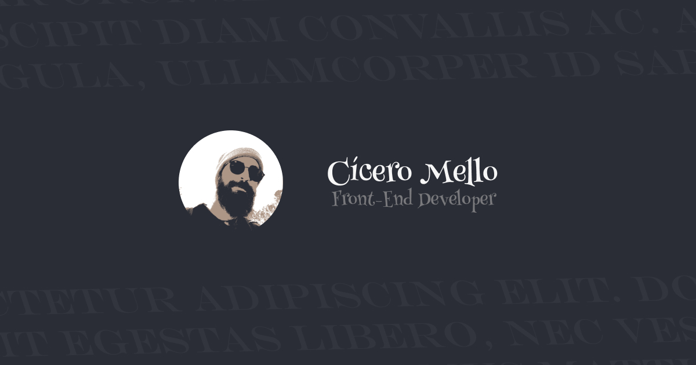

# Portfolio [https://www.ciceromello.com]

    

## 🤨 What is this?

**My first portfolio**, a place to demonstrate part of my skills and my history.

- You can see my main technologies
- Landing page with storytelling
- Custom domain, SEO, responsive and optimized for different devices
- Idea, structure, and design was made by me

## 👨🏼‍💻 Main Technologies/Tools Used

**Development**
- Qwik (framework)
- TypeScript ("language")
- Vanilla Extract (CSS in TS)
- GSAP (scroll trigger and svg morph)
- Own Libraries (glitch and typing animations)
- Vite (build tool)
- ESLint (code analysis)
- Prettier (formatter)

**Design**
- Figma

##

> (CC BY-NC-ND 4.0) | Designed and developed by Cícero Mello
